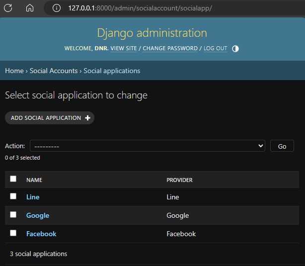
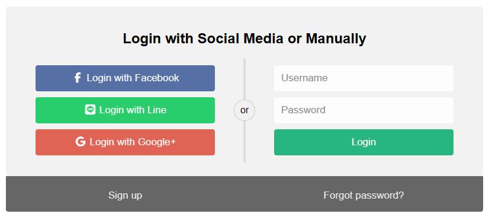

# Social Authentication with Django

A demonstrate how to use social authentication with Django. Use the Allauth Social Oauth2 library to handle the social authentication.

## Technologies and Tools

- [Python](https://www.python.org/)
- [Django](https://www.djangoproject.com/)
- [Django Allauth](https://allauth.org/)

## Requirements

- Client id and secret key from the social media provider.
- Server with SSL certificate for non-localhost domains.

## Installation

pip install -r requirements.txt
python manage.py migrate
python manage.py createsuperuser
python manage.py runserver

## Usage

get the client id and secret key from the social media provider and add them through the Django admin panel. "/admin/socialaccount/socialapp/"

Callback URL for the social media provider should be `http://localhost:8000/accounts/{provider}/login/callback/`

Example:

- `http://localhost:8000/accounts/google/login/callback/`
- `http://localhost:8000/accounts/facebook/login/callback/`
- `http://localhost:8000/accounts/line/login/callback/`

## Screenshots

